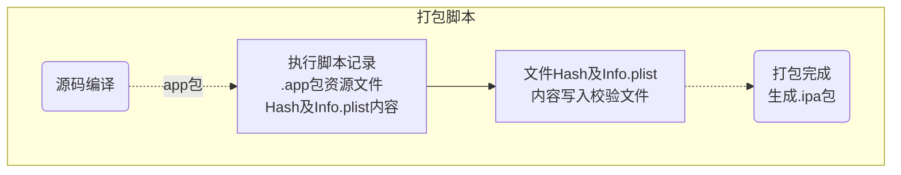
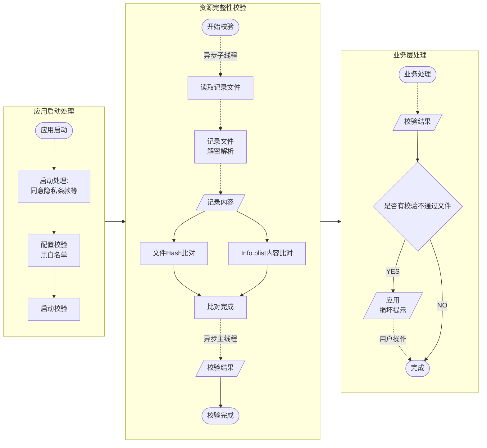
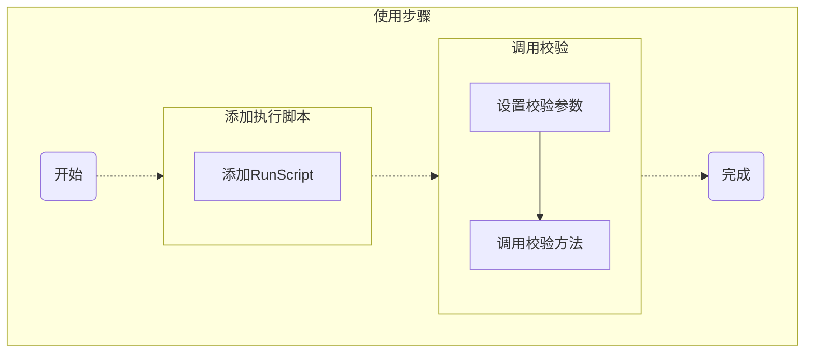
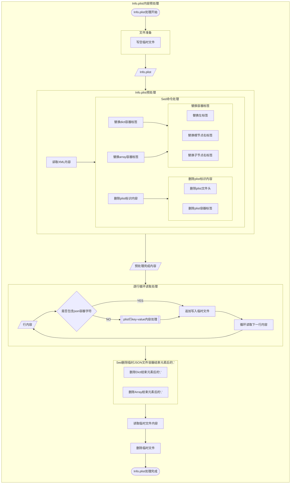
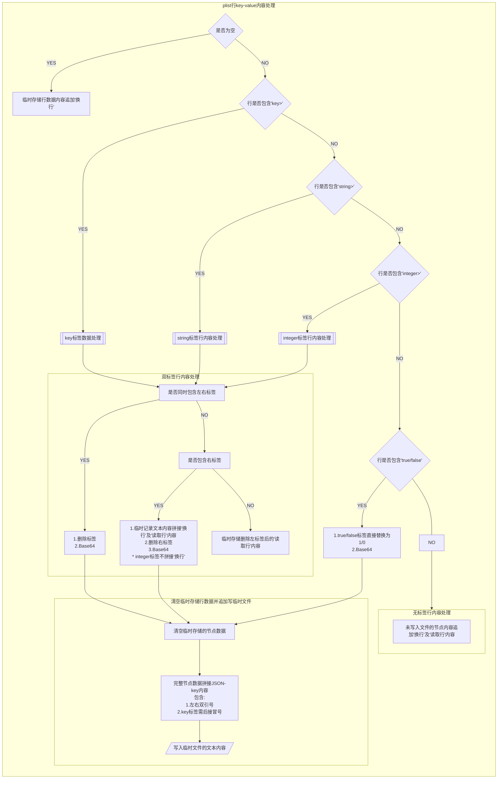
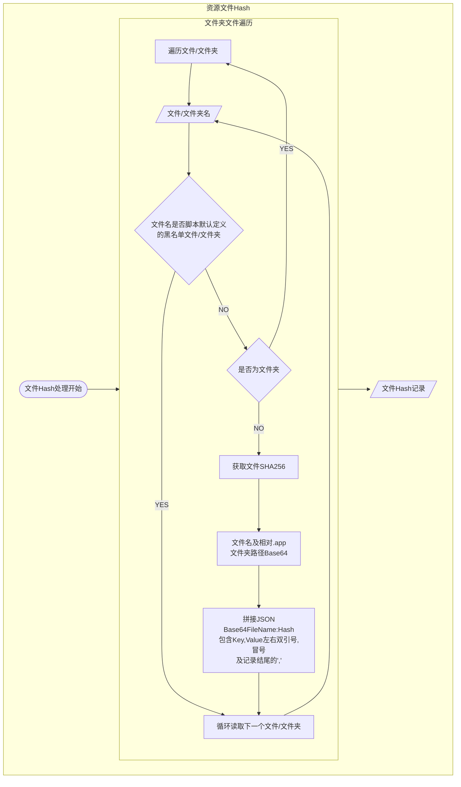
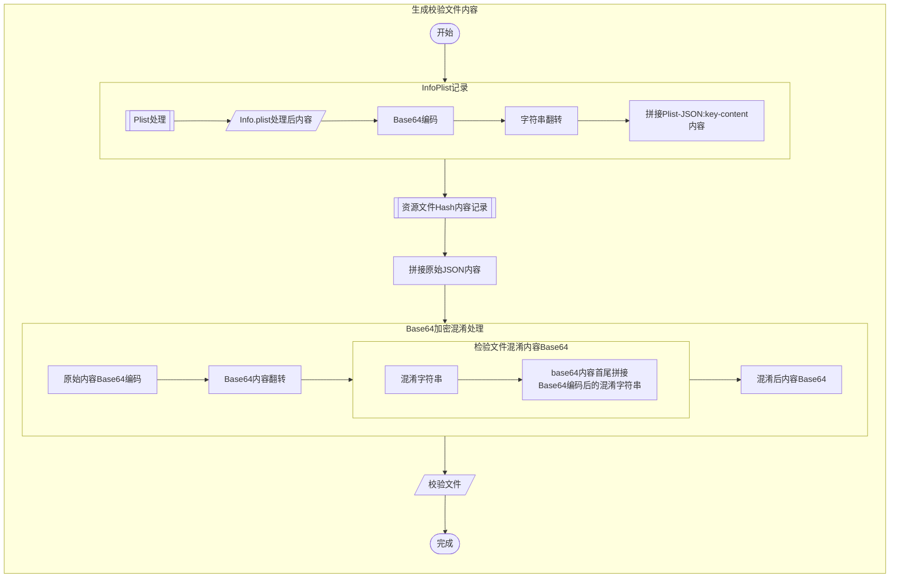

<!--
 * @Author: 梅继高
 * @Date: 2022-05-17 13:53:31
 * @LastEditTime: 2022-05-27 00:11:01
 * @LastEditors: 梅继高
 * @Description: 
 * @FilePath: /undefined/Users/meijigao/Desktop/Git•GitHub/Dengni8023/JGSourceBase/JGSIntegrityCheck/README.md
 * Copyright © 2022 MeiJiGao. All rights reserved.
-->
#  <center>应用完整性校验之资源文件检验</center>

<center><font style='color: gray'>JGSIntegrityCheck使用手册及方案介绍</font></center>

[TOC]

## 1. 校验方案

* 校验资源文件生成流程



* 应用启动时根据校验资源文件校验应用资源文件



应用编译完成打包结束前执行打包脚本，进行`.app`包中文件Hash记录，记录内容存入`JGSApplicationIntegrityCheckFileHashFile`文件

* 根目录`Info.plist`文件因上传商店时会进行自端增、删、改处理，针对该文件不记录文件`Hash`，因该文件再项目中作为`Dictionary`形式使用，使用`JSON`格式记录该文件内容

* 文件`Hash`记录默认忽律以下文件，不区分根目录、子目录

	```
	"${PRODUCT_NAME}" # Target二进制文件
	"${ResourcesHashFileNameWithExt}" # 校验记录文件
	"_CodeSignature" # 通用签名文件
	"Assets.car" # Assets文件，应用商店下载时商店对改文件做删减、优化
	"Frameworks" # 依赖Frameworks包文件
	"PlugIns" # 扩展插件
	"embedded.mobileprovision" # 打包描述文件，上传商店商店会重签名打包导致文件变化
	"Info.plist" # 根目录Info.plist商店包上传会增删改，独立记录文件内容，子目录不做任何记录处理
	```

* 应用启动时查找是否存在`JGSApplicationIntegrityCheckFileHashFile`文件，存在该文件，则执行资源文件`Hash`校验，以及`Info.list`内容校验

* 考虑校验的灵活性，记录脚本除上述忽略的文件，其他根目录、子目录文件均进行文件`Hash`记录或`Info.plist`全内容记录，在应用执行检查时支持检验黑白名单配置以忽略部分文件以及部分`Info.plist`内容的校验。即脚本记录校验信息，实际校验时可不校验黑名单配置的内容

<strong style='color: red'>

⚠️ 校验只针对修改进行处理，对增删`Info.plist`字段、资源文件不做处理

</strong>

## 2. 使用方法



### 2.1 打包脚本使用

#### 2.1.1 Pod引入方式

##### 方式一：`Podfile`添加自定义脚本

`Podfile`添加自定义脚本`script_phase`，执行`pod install`后，主`Target`将添加`RunScript`，以执行`JGSIntegrityCheckRecordResourcesHash.sh`脚本

* 需要在编译结束时执行`JGSIntegrityCheckRecordResourcesHash.sh`脚本，因此`script_phase`需要指定`:execution_position => :after_compile`

`Podfile`内脚本定义格式如下：

```
target "TARGET_NAME" do

	...
	pod 'JGSourceBase'
	JGSApplicationIntegrityCheckScript = <<-CMD
	
		echo "AfterCompile: 执行应用完整性校验-记录资源文件Hash脚本"
		# 网络引用方式依赖脚本文件路径
		ShellPath="${PODS_ROOT}/JGSourceBase/JGSIntegrityCheck/JGSIntegrityCheckRecordResourcesHash.sh"
		if [[ ! -f "${ShellPath}" ]]; then
			# 本地引用方式依赖脚本文件路径
			ShellPath="${PROJECT_DIR}/JGSIntegrityCheck/JGSIntegrityCheckRecordResourcesHash.sh"
		fi
		
		# echo "${ShellPath}"
		if [[ -f "${ShellPath}" ]]; then
			chmod +x ${ShellPath} # 脚本执行权限
			${ShellPath} # 执行脚本
		fi
	CMD
	script_phase :name => "JGSIntegrityCheck", :script => JGSApplicationIntegrityCheckScript, :execution_position => :after_compile
	...
	
	# project
	project "PROJECT_NAME.xcodeproj"
end
```

##### 方式二：主`Target`添加`RunScript`脚本

添加`RunScript`执行`JGSIntegrityCheckRecordResourcesHash.sh`脚本

* 需要在编译结束时执行`JGSIntegrityCheckRecordResourcesHash.sh`脚本，因此`RunScript`需要放到`Build Phases`的<font style='color: red'>最底部</font>

```
echo "AfterCompile: 执行应用完整性校验-记录资源文件Hash脚本"
# 网络引用方式依赖脚本文件路径
ShellPath="${PODS_ROOT}/JGSourceBase/JGSIntegrityCheck/JGSIntegrityCheckRecordResourcesHash.sh"
if [[ ! -f "${ShellPath}" ]]; then
	# 本地引用方式依赖脚本文件路径
	ShellPath="${PROJECT_DIR}/JGSIntegrityCheck/JGSIntegrityCheckRecordResourcesHash.sh"
fi
	
# echo "${ShellPath}"
if [[ -f "${ShellPath}" ]]; then
	chmod +x ${ShellPath} # 脚本执行权限
	${ShellPath} # 执行脚本
fi
```

<font style='color: red'>

* 以上两种方式实现原理、脚本内容基本一致，因`pod install`能保证将添加的自定义脚本始终保持在`Build Phases`最底部，推荐在`Podfile`中添加自定义脚本

</font>

#### 2.1.2 源码或`framewok`打包引入方式

主`Target`添加`RunScript`执行`JGSIntegrityCheckRecordResourcesHash.sh`脚本，执行`RunScript`需要放到编译结束，即在`Xcode->Target->Build Phases`导航中，执行脚本的`RunScript`需要在最底部位置，脚本内容如下：

```
echo "AfterCompile: 执行应用完整性校验-记录资源文件Hash脚本"

# 自助framework打包引入脚本文件路径
ShellPath="${BUILT_PRODUCTS_DIR}/JGSourceBase.framework/JGSIntegrityCheckRecordResourcesHash.sh"

# echo "${ShellPath}"
if [[ -f "${ShellPath}" ]]; then
	chmod +x ${ShellPath} # 脚本执行权限
	${ShellPath} # 执行脚本
fi
```

<strong style='color: red'>

⚠️ 脚本内容也可以自定义脚本文件，脚本内容修改为执行自定脚本即可

⚠️ 参考上述脚本内容，`Pod`引入、源码引入、`framework`引入保证正确配置脚本`ShellPath`即可正常执行打包脚本记录校验信息

</strong>

### 2.2 应用启动后校验资源文件

因监管等要求，应用启动优先展示隐私协议等内容，不同应用隐私协议等展示处理方式不一，资源文件校验不自动触发，需要应用系统自行选择合理时机触发。触发前根据`JGSIntegrityCheckResourcesHash`说明合理配置黑、白名单，之后触发`checkAPPResourcesHash:`检测逻辑，并处理异步返回的结果。

```
[[JGSIntegrityCheckResourcesHash shareInstance] setCheckInfoPlistKeyBlacklist:@[
	@"MinimumOSVersion",
	@"CFBundleURLTypes.CFBundleURLName",
	@"NSAppTransportSecurity.NSAllowsArbitraryLoads"
]];
[[JGSIntegrityCheckResourcesHash shareInstance] checkAPPResourcesHash:^(NSArray<NSString *> * _Nullable unpassFiles, NSDictionary * _Nullable unpassPlistInfo) {
	JGSLog(@"%@, %@", unpassFiles, unpassPlistInfo);
	...
	alert("您安装的应用已损坏，存在安全隐患，请退出应用，并从官方渠道下载安装后使用！")
	...
}];
```

## 3. 打包脚本及校验过程
### 3.1 打包脚本逻辑

`JGSIntegrityCheckRecordResourcesHash.sh`脚本记录资源文件`Hash`及`Info.plist`文件内容

#### 3.1.1 `Info.plist`文件内容记录





```
function recordInfoPlistJSON() { ... }
```

根据`plist`文件特性，移除非必要标签、替换XML文件标签为`JSON`分隔符，构成标准`JSON`

⚠️ 考虑`key`、`value`中可能存在英文引号情况，针对`key`、`value`均采用`Base64`加密处理

⚠️ 考虑不规范情况下`key`、`value`中可能存在换行情况，针对`key`、`value`处理分别匹配`XML`中的左右标签

处理过程如下：

1. 读取`Info.plist`文件内容为字符串
2. 字符串去除`plist`文件头 `?xml`, `!DOCTYPE`, 及 `<plist>`, `</plist>` 标签
3. 替换`Dict`、`Array`左右标签

	> 3.1. 左标签直接替换为 "{" 或 "["，不需要添加其他分隔符号
	> 
	> 3.2. 根节点的右标签直接替换，不需要添加其他分隔符号
	> 
	> 3.3. 子节点右标签替换需要添加逗号","分隔符，对于容器结束元素可能存在分隔符多余情况，替换完成后统一处理

4. 以上完成容器左右标签替换，接下来进行`key`、`value`的替换
5. <strong style='color:red'>逐行遍历</strong>经过上述步骤处理后的文本内容，使用`sed`命令处理每行内容，每处理一段完整内容就追加写入临时文件，`Info.plist`内容包含如下标签，需分别处理

	> 5.1 \<key>...\</key>
	> 
	> 5.2 \<string>...\</string>
	> 
	> 5.3 \<integer>...\</integer>
	> 
	> 5.4 \<true/>, \<false/>

	⚠️ 首次写入临时文件前为避免文件残留，追加写入内容前先覆盖写空内容
	
	⚠️ 替换过程如果左右标签在一行文本中，则直接`Base64`处理
	
	⚠️ 如左右标签中间内容存在换行、空行情况，则识别到左标签时开始记录内容
	
	⚠️ 中间未识别右标签，则逐行追加内容。`Integer`标签正常是不存在换行情况，特殊情况不添加换行符，各行直接拼接；其他标签逐行追加时添加换行符，保持文本一致性
	
	⚠️ 识别到右标签时，完成标签内容记录，进行`Base64`处理
	
	`Base64`处理脚本示例如下：
	
	```
	# <key>...</key> Base64 处理脚本
	local keyLine=$(
	    printf "${readLine}" |
	    sed "s/^<key>\(.*\)<\/key>$/\1/g" |
	    base64
	)
	```

6. 经以上步骤处理之后，基本形成完成的`JSON`数据，但是针对容器结尾元素存在多余逗号分隔符","问题，需进行替换

	> 6.1 替换 ",]" 为 "]"
	>
	> 6.2 替换 ",}" 为 "}"

7. 完成以上步骤后，`Info.plist`文件处理完成，需要读取临时文件内容，之后删除临时文件

	```
	# 读取临时文件内容，并删除临时文件
	printf "$(cat ${tmpPlistJson})"
	rm -f "${tmpPlistJson}"
	```

#### 3.1.2 资源文件`Hash`记录



```
function recordResourceFilesHashInDir() { ... }
```

读取本目录下所有文件，非文件夹文件记录文件`SHA256`，文件夹则递归处理子目录文件。

文件`Hash`记录使用`Key-Value`形式记录到记录文件，其中：

> Key：文件相对 .app 目录的相对路径，为避免文件名特殊字符等情况，使用 Base64 编码
> 
> Value：文件 SHA256 码

注意：

⚠️ 脚本默认配置的黑名单文件不记录`Hash`

⚠️ 黑名单未区分子目录，仅按照文件/文件夹名称匹配

⚠️ 为便于后续拼接`JSON`，每行`Key-Value`结束包含逗号","，格式为：`"Key":"Value", `

#### 3.1.3 生成校验文件内容



```
# 文件 Hash 记录脚本入口方法
function recordAPPResourceHashToCheckFile() { ... }
```

1. `Info.plist`处理，调用`recordInfoPlistJSON`，记录`Info.plist`内容`JSON`，并进行`Base64`编码，生成`Info.plist`在记录文件原始`JSON`中的行内容

	```
	# 根目录Info.plist文件内容
	local plistName="Info.plist"
	local plistPath="${ProductDir}/${plistName}"
	local plistContent=$(printf "$(recordInfoPlistJSON "${plistPath}")" | base64)
	local plistKey=$(printf "${plistName}" | base64)
	local plistLine="\"${plistKey}\":\"${plistContent}\""
	```

2. 生成其他所有资源`Hash`记录内容，调用`recordResourceFilesHashInDir`

	```
	# 其他所有资源文件Hash记录，仅包含多行 Key-Value 内容及行末逗号","
	local allResContent=$(recordResourceFilesHashInDir ".")
	```

3. 拼接校验文件原始`JSON`，并`Base64`编码后翻转

	```
	# 拼接原始JSON，并Base64编码后翻转
	local JSONContent="{${allResContent}${plistLine}}"
	local JSONBase64=$(printf "${JSONContent}" | base64 | rev)
	```
	
4. 校验内容收尾加盐后`Base64`编码

	```
	# 校验内容收尾加盐后Base64编码
	local saltBase64=$(printf "${ResourcesHashBase64Salt}" | base64)
	local checkContent=$(printf "${saltBase64}${JSONBase64}${saltBase64}" | base64)
	```
5. 校验内容覆盖写入校验文件`JGSApplicationIntegrityCheckFileHashFile`

	```
	# 覆盖写入记录文件
	local recordFilePath="${ProductDir}/${ResourcesHashFileName}"
	coverContent2File "${checkContent}" "${recordFilePath}" # 覆盖数据，避免异常过程残留文件内容
	```
	
### 3.2 应用启动校验逻辑

`JGSIntegrityCheckResourcesHash`类子线程完成资源文件`Hash`及`Info.plist`文件内容比对，异步返回比对结果，包括比对不通过文件以及`Info.plist`校验不通过`key`相关信息信息

#### 3.2.1 校验配置

```

/// Info.plist文件key黑名单，多层级对象黑名单层级间使用"."分隔，数组元素黑名单针对数组元素设置
/// 如：{key: [{key1: value1, key2: value2}]} 设置：key.key1，对数组内元素key1值将不进行校验
@property (nonatomic, copy) NSArray<NSString *> *checkInfoPlistKeyBlacklist;

/// 需要检验的子目录白名单，该属性不为空时，非白名单子目录均不做校验；文件夹路径全匹配，区分大小写；支持多层目录，路径需从起始目录开始
@property (nonatomic, copy) NSArray<NSString *> *checkFileSubDirectoryWhitelist;

/// 文件Hash校验文件名黑名单，文件名称全匹配，区分大小写
@property (nonatomic, copy) NSArray<NSString *> *checkFileNameBlacklist;

/// 文件Hash校验文件夹黑名单，文件夹路径全匹配，区分大小写；支持多层目录，路径需从起始目录开始
@property (nonatomic, copy) NSArray<NSString *> *checkFileDirectoryBlacklist;

/// 文件Hash校验文件扩展名黑名单，扩展名配置不需要包括"."，支持配置多级扩展，如：“a.b” 表示形如 name.a.b 的文件
@property (nonatomic, copy) NSArray<NSString *> *checkFileExtesionBlacklist;

```

#### 3.2.2 校验方法

```
/// 检测资源文件Hash、Info.plist文件内容是否发生变化，检测仅针对文件、Info.plist文件Key对应Value内容变化，无法检测文件增删、Info.plist文件Key增删
/// @param completion 检测结果响应
/// unpassFiles 检测未通过的资源文件文件名，包含相对路径
/// unpassPlistInfo Info.plist文件检测未通过内容的Key信息
- (void)checkAPPResourcesHash:(nullable void (^)(NSArray<NSString *> * _Nullable unpassFiles, NSDictionary * _Nullable unpassPlistInfo))completion;
```

考虑校验文件Hash、内容需要进行文件读写，此方法内部使用异步线程处理，检测结果异步返回。
