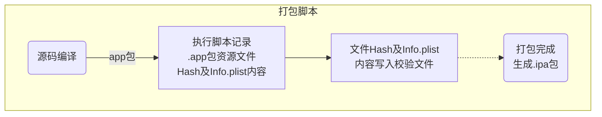
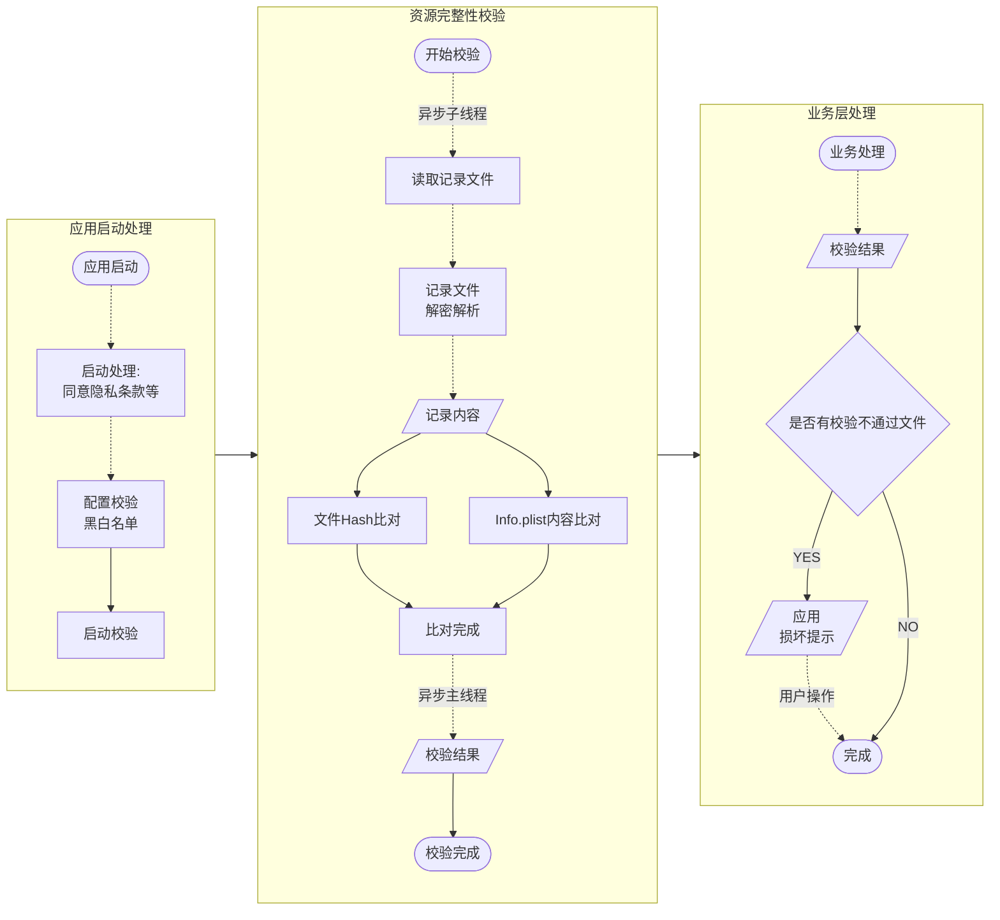
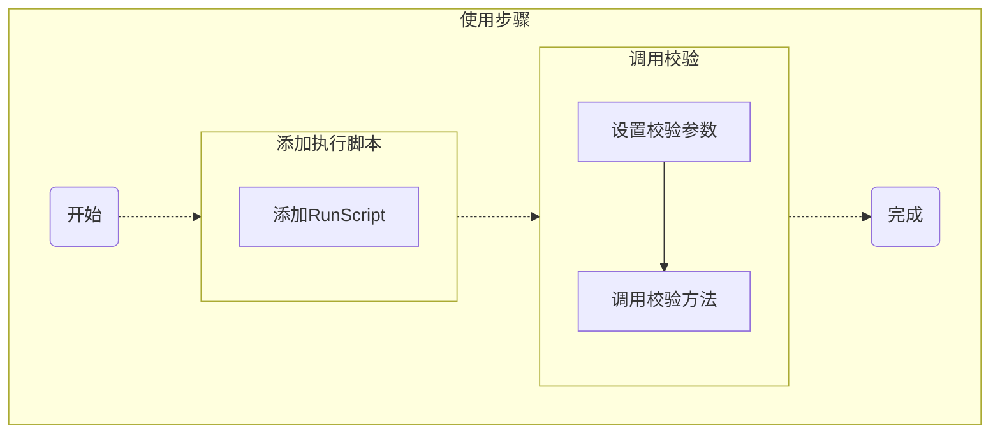
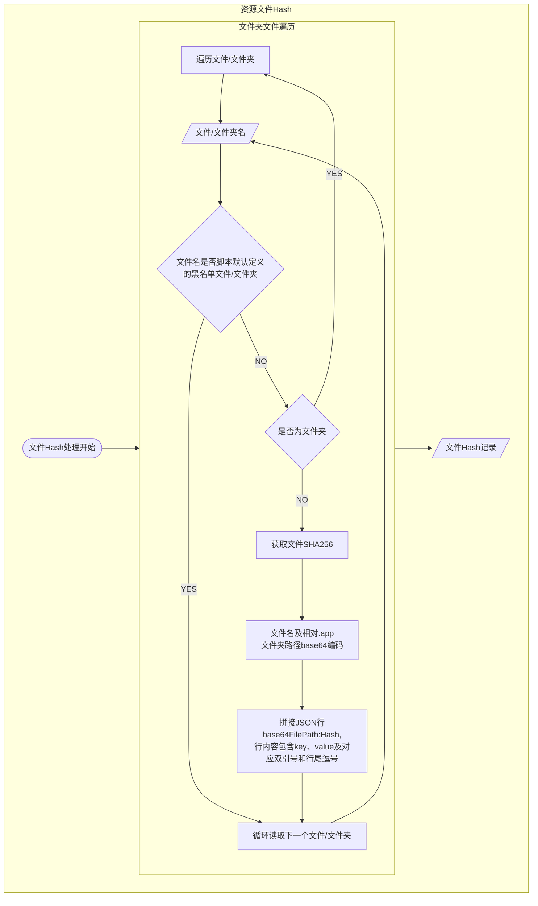
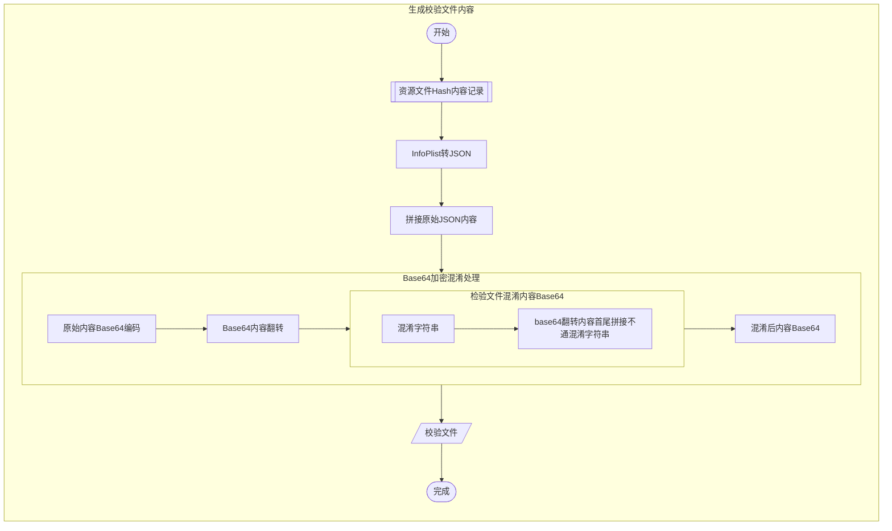

<!--
 * @Author: 梅继高
 * @Date: 2022-05-17 13:53:31
 * @LastEditTime: 2025-04-14 13:24:20
 * @LastEditors: Dengni8023
 * @Description: 
 * @FilePath: /JGSourceBase/JGSourceBase/JGSIntegrityCheck/README.md
 * Copyright © 2022 MeiJiGao. All rights reserved.
-->
#  <center>应用完整性校验之资源文件检验</center>

<font style='color: gray'>`JGSIntegrityCheck`使用手册及方案介绍
</font>

[TOC]

## 1. 校验方案

* 校验资源文件生成流程



* 应用启动时根据校验资源文件校验应用资源文件



应用编译完成打包结束前执行打包脚本，进行`.app`包中文件Hash记录，记录内容存入`JGSAppIntegrityCheckFile.json`文件

* 根目录`Info.plist`文件因上传商店时会进行自端增、删、改处理，针对该文件不记录文件`Hash`，因该文件在项目中作为`Dictionary`形式使用，使用`JSON`格式记录该文件内容

* 文件`Hash`记录默认忽律以下文件，不区分根目录、子目录

	```Objective-C/Swift
	"${PRODUCT_NAME}" # Target二进制文件
	"${ResourcesHashFileNameWithExt}" # 校验记录文件
	"_CodeSignature" # 通用签名文件
	"Assets.car" # Assets文件，应用商店下载时商店对改文件做删减、优化
	"Frameworks" # 依赖Frameworks包文件
	"PlugIns" # 扩展插件
	"embedded.mobileprovision" # 打包描述文件，上传商店商店会重签名打包导致文件变化
	"Info.plist" # 根目录Info.plist商店包上传会增删改，独立记录文件内容，子目录按照资源文件记录`Hash`
	```

* 应用启动时查找是否存在`JGSAppIntegrityCheckFile.json`文件，存在该文件，则执行资源文件`Hash`校验，以及`Info.list`内容校验

* 考虑校验的灵活性，记录脚本除上述忽略的文件，其他根目录、子目录文件均进行文件`Hash`记录，在应用执行检查时支持检验黑白名单配置以忽略部分文件以及部分`Info.plist`内容的校验。即脚本记录校验信息，实际校验时可不校验黑名单配置的内容

<strong style='color: red'>

⚠️ 校验只针对修改进行处理，对增删资源文件、`Info.plist`字段情况不做校验处理

</strong>

## 2. 使用方法



### 2.1 打包脚本使用

#### 2.1.1 Pod引入方式

##### 方式一：`Podfile`添加自定义脚本

`Podfile`添加自定义脚本`script_phase`，执行`pod install`后，主`Target`将添加`RunScript`，以执行`JGSIntegrityCheckRecordResourcesHash.sh`脚本

* 需要在编译结束时执行`JGSIntegrityCheckRecordResourcesHash.sh`脚本，因此`script_phase`需要指定`:execution_position => :after_compile`

`Podfile`内脚本定义格式如下：

```gem
target "TARGET_NAME" do

	pod 'JGSourceBase'
	JGSApplicationIntegrityCheckScript = <<-CMD
	
		echo "AfterCompile: 执行应用完整性校验-记录资源文件Hash脚本"
		# 网络引用方式依赖脚本文件路径
		ShellPath="${BUILT_PRODUCTS_DIR}/${TARGET_NAME}.app/JGSourceBase.bundle/JGSIntegrityCheckRecordResourcesHash.sh"
		echo "${ShellPath}"
		if [[ -f "${ShellPath}" ]]; then
			chmod +x ${ShellPath} # 脚本执行权限
			${ShellPath} # 执行脚本
		fi

		echo "为避免脚本泄漏，脚本之行完成后，删除脚本"
		rm -fr "${ShellPath}"
	CMD
	script_phase :name => "JGSIntegrityCheck", :script => JGSApplicationIntegrityCheckScript, :execution_position => :after_compile
	...
	
	# project
	project "PROJECT_NAME.xcodeproj"
end
```

##### 方式二：主`Target`添加`RunScript`脚本

添加`RunScript`执行`JGSIntegrityCheckRecordResourcesHash.sh`脚本

* 需要在编译结束时执行`JGSIntegrityCheckRecordResourcesHash.sh`脚本，因此`RunScript`需要放到`Build Phases`的<font style='color: red'>最底部</font>

```gem
echo "AfterCompile: 执行应用完整性校验-记录资源文件Hash脚本"
# 网络引用方式依赖脚本文件路径
ShellPath="${BUILT_PRODUCTS_DIR}/${TARGET_NAME}.app/JGSourceBase.bundle/JGSIntegrityCheckRecordResourcesHash.sh"
echo "${ShellPath}"
if [[ -f "${ShellPath}" ]]; then
	chmod +x ${ShellPath} # 脚本执行权限
	${ShellPath} # 执行脚本
fi

echo "为避免脚本泄漏，脚本之行完成后，删除脚本"
rm -fr "${ShellPath}"
```

<font style='color: red'>

* 以上两种方式实现原理、脚本内容基本一致，因`pod install`基本能保证将添加的自定义脚本始终保持在`Build Phases`最底部，建议在`Podfile`中添加自定义脚本
* 如执行`pod install`之后，应用完整性校验脚本不在`Build Phases`最底部，则可在`Build Phases`中手动将脚本任务拖动到最底部

</font>

#### 2.1.2 源码或`framewok`打包引入方式

主`Target`添加`RunScript`执行`JGSIntegrityCheckRecordResourcesHash.sh`脚本，执行`RunScript`需要放到编译结束，即在`Xcode->Target->Build Phases`导航中，执行脚本的`RunScript`需要在最底部位置，脚本内容如下：

```
echo "AfterCompile: 执行应用完整性校验-记录资源文件Hash脚本"

# 自助framework打包引入脚本文件路径
ShellPath="${BUILT_PRODUCTS_DIR}/${TARGET_NAME}.app/JGSourceBase.bundle/JGSIntegrityCheckRecordResourcesHash.sh"
echo "${ShellPath}"
if [[ -f "${ShellPath}" ]]; then
	chmod +x ${ShellPath} # 脚本执行权限
	${ShellPath} # 执行脚本
fi

echo "为避免脚本泄漏，脚本之行完成后，删除脚本"
rm -fr "${ShellPath}"
```

<strong style='color: red'>

⚠️ 脚本内容也可以自定义脚本文件，脚本内容修改为执行自定脚本即可

⚠️ 参考上述脚本内容，`Pod`引入、源码引入、`framework`引入保证正确配置脚本`ShellPath`即可正常执行打包脚本记录校验信息

</strong>

### 2.2 应用启动后校验资源文件

因监管等要求，应用启动优先展示隐私协议等内容，不同应用隐私协议等展示处理方式不一，资源文件校验不自动触发，需要应用系统自行选择合理时机触发。触发前请根据`JGSIntegrityCheckResourcesHash`说明合理配置黑、白名单，之后触发`checkAPPResourcesHash:`检测逻辑，并处理异步返回的结果。

```
[[JGSIntegrityCheckResourcesHash shareInstance] setCheckInfoPlistKeyBlacklist:@[
	@"MinimumOSVersion",
	@"CFBundleURLTypes.CFBundleURLName",
	@"NSAppTransportSecurity.NSAllowsArbitraryLoads"
]];
[[JGSIntegrityCheckResourcesHash shareInstance] checkAPPResourcesHash:^(NSArray<NSString *> * _Nullable unpassFiles, NSDictionary * _Nullable unpassPlistInfo) {
	JGSLog(@"%@, %@", unpassFiles, unpassPlistInfo);
	...
	alert("您安装的应用已损坏，存在安全隐患，请退出应用，并从官方渠道下载安装后使用！")
	...
}];
```

## 3. 打包脚本及校验过程
### 3.1 打包脚本逻辑

`JGSIntegrityCheckRecordResourcesHash.sh`脚本记录资源文件`Hash`及`Info.plist`文件内容

#### 3.1.1 资源文件`Hash`记录



```
function recordResourceFilesHashInDir() { ... }
```

读取本目录下所有文件，非文件夹文件记录文件`SHA256`，文件夹则递归处理子目录文件。

文件`Hash`记录使用`Key-Value`形式记录到记录文件，其中：

> Key：文件相对 .app 目录的相对路径，为避免文件名特殊字符等情况，使用 Base64 编码
> 
> Value：文件 SHA256 码

注意：

⚠️ 脚本默认配置的黑名单文件不记录`Hash`

⚠️ 黑名单未区分子目录，仅按照文件/文件夹名称匹配

⚠️ 为便于后续拼接`JSON`，每行`Key-Value`结束包含逗号","，格式为：`"Key":"Value",`

#### 3.1.2 `Info.plist`文件内容转`JSON`记录

`Xcode15`打包出的`Info.plist`无法直接直接读取文件内容，进行`sed`处理，`1.4.4`版本开始，直接通过`plutil`命令将`Info.plist`内容转换为`JSON`文本进行记录，简化之前版本`sed`处理流程

```shell
# 根目录Info.plist文件内容转JSON
local plistContent="{}"
local plistPath="${ProductDir}/${InfoPlistFile}"
if [[ -f ${plistPath} ]]; then
    local tmpPlistJson="${ProductDir}/${ResourcesHashFileName}-plist.json"
    plutil -convert json -o "${tmpPlistJson}" "${plistPath}"
    plistContent=$(cat "${tmpPlistJson}")
    rm -fr "${tmpPlistJson}" # 清理临时文件
fi
# echo "${InfoPlistFile}: ${plistContent}"
# 资源文件文件名有base64编码，此处保持一致
local plistKey=$(printf "${InfoPlistFile}" | base64)
local plistLine="\"${plistKey}\":${plistContent}"
```

#### 3.1.3 生成校验文件内容



```
# 文件 Hash 记录脚本入口方法
function recordAPPResourceHashToCheckFile() { ... }
```

1. 生成其他所有资源`Hash`记录内容，调用`recordResourceFilesHashInDir`

	```shell
    # 非Info.plist资源文件Hash记录，仅包含多行 Key-Value 内容及行末逗号","
    recordResourceFilesHashInDir "."
	```

2. `Info.plist`转`JSON`处理

	```shell
    # 根目录Info.plist文件内容转JSON
    local plistContent="{}"
    local plistPath="${ProductDir}/${InfoPlistFile}"
    if [[ -f ${plistPath} ]]; then
        local tmpPlistJson="${ProductDir}/${ResourcesHashFileName}-plist.json"
        plutil -convert json -o "${tmpPlistJson}" "${plistPath}"
        plistContent=$(cat "${tmpPlistJson}")
        rm -fr "${tmpPlistJson}" # 清理临时文件
    fi
    # echo "${InfoPlistFile}: ${plistContent}"
    # 资源文件文件名有base64编码，此处保持一致
    local plistKey=$(printf "${InfoPlistFile}" | base64)
    local plistLine="\"${plistKey}\":${plistContent}"
	```

3. 拼接校验文件原始`JSON`，并`Base64`编码后翻转

	```shell
    # 拼接完整JSON结构，Base64编码后翻转
    local allResContent="{${FileResHashJSON}${plistLine}}"
    allResContent=$(printf "${allResContent}" | base64 | rev)
	```
	
4. 校验内容收尾加盐后`Base64`编码

	```shell
    # 校验内容首尾加盐后Base64编码
    local saltBase=$(printf "${ResourcesHashFileName}" | base64)
    local saltRev=$(printf "${saltBase}" | rev)
    # echo "saltBase-1: ${saltBase}"
    # echo "saltRev-1: ${saltRev}"
    saltBase=$(printf "${saltBase}" | sha256sum | cut -d ' ' -f1)
    saltRev=$(printf "${saltRev}" | sha256sum | cut -d ' ' -f1)
    # echo "saltBase-2: ${saltBase}"
    # echo "saltRev-2: ${saltRev}"
    local checkContent=$(printf "${saltBase}${allResContent}${saltRev}" | base64)
	```
5. 校验内容覆盖写入校验文件`JGSApplicationIntegrityCheckFileHashFile.json`

	```shell
    # > 覆盖写入文件
    # >> 追加写入文件
    # 覆盖数据，避免异常过程残留文件内容
    # 全文覆盖请使用echo，文本结束会输出换行
    local recordFilePath="${ProductDir}/${ResourcesHashFileName}.json"
    echo "${checkContent}" > "${recordFilePath}"
	```
	
### 3.2 应用启动校验逻辑

`JGSIntegrityCheckResourcesHash`类子线程完成资源文件`Hash`及`Info.plist`文件内容比对，异步返回比对结果，包括比对不通过文件以及`Info.plist`校验不通过`key`相关信息信息

#### 3.2.1 校验配置

```Objective-c/Swifts

/// Info.plist文件key黑名单，多层级对象黑名单层级间使用"."分隔，数组元素黑名单针对数组元素设置
/// 如：{key: [{key1: value1, key2: value2}]} 设置：key.key1，对数组内元素key1值将不进行校验
@property (nonatomic, copy) NSArray<NSString *> *checkInfoPlistKeyBlacklist;

/// 需要检验的子目录白名单，该属性不为空时，非白名单子目录均不做校验；文件夹路径全匹配，区分大小写；支持多层目录，路径需从起始目录开始
@property (nonatomic, copy) NSArray<NSString *> *checkFileSubDirectoryWhitelist;

/// 文件Hash校验文件名黑名单，文件名称全匹配，区分大小写
@property (nonatomic, copy) NSArray<NSString *> *checkFileNameBlacklist;

/// 文件Hash校验文件夹黑名单，文件夹路径全匹配，区分大小写；支持多层目录，路径需从起始目录开始
@property (nonatomic, copy) NSArray<NSString *> *checkFileDirectoryBlacklist;

/// 文件Hash校验文件扩展名黑名单，扩展名配置不需要包括"."，支持配置多级扩展，如：“a.b” 表示形如 name.a.b 的文件
@property (nonatomic, copy) NSArray<NSString *> *checkFileExtesionBlacklist;

```

#### 3.2.2 校验方法

```Objective-c/Swifts
/// 检测资源文件Hash、Info.plist文件内容是否发生变化，检测仅针对文件、Info.plist文件Key对应Value内容变化，无法检测文件增删、Info.plist文件Key增删
/// @param completion 检测结果响应
/// unpassFiles 检测未通过的资源文件文件名，包含相对路径
/// unpassPlistInfo Info.plist文件检测未通过内容的Key信息
- (void)checkAPPResourcesHash:(nullable void (^)(NSArray<NSString *> * _Nullable unpassFiles, NSDictionary * _Nullable unpassPlistInfo))completion;
```

考虑校验文件Hash、内容需要进行文件读写，此方法内部使用异步线程处理，检测结果异步返回。
