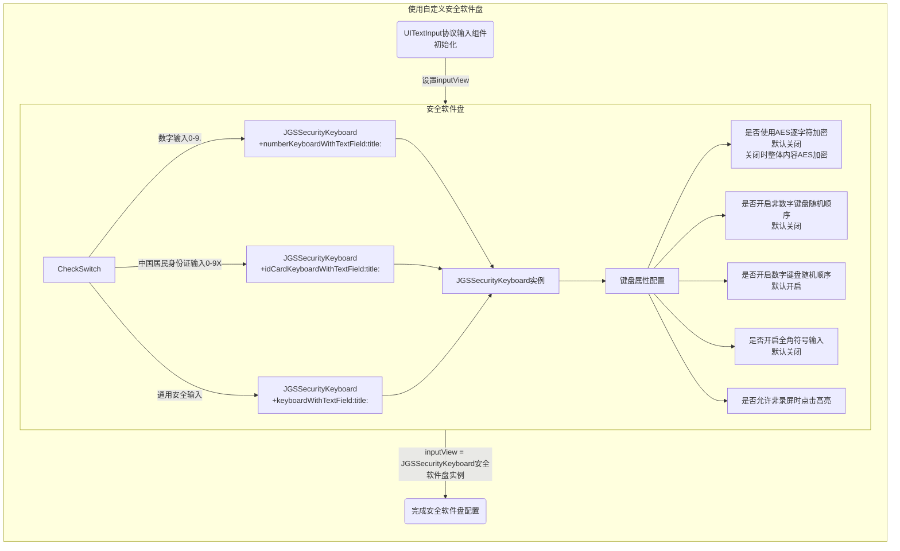
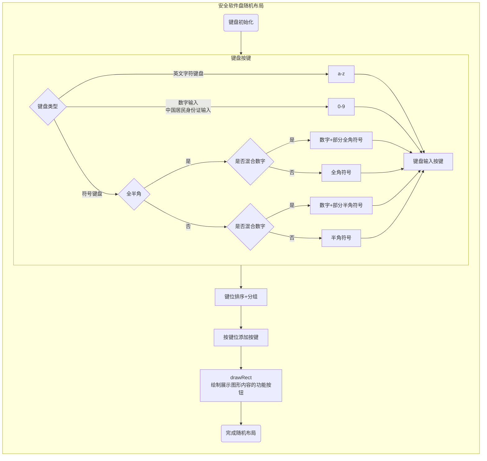
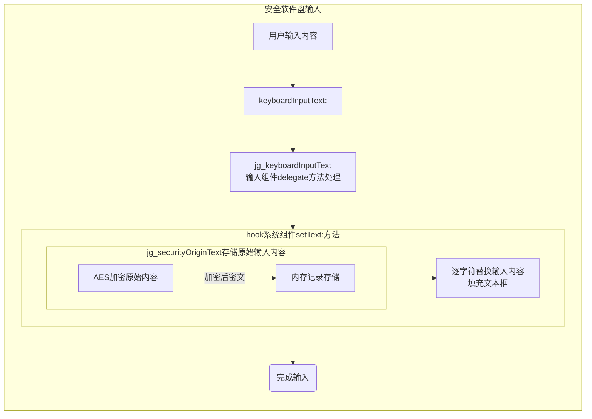
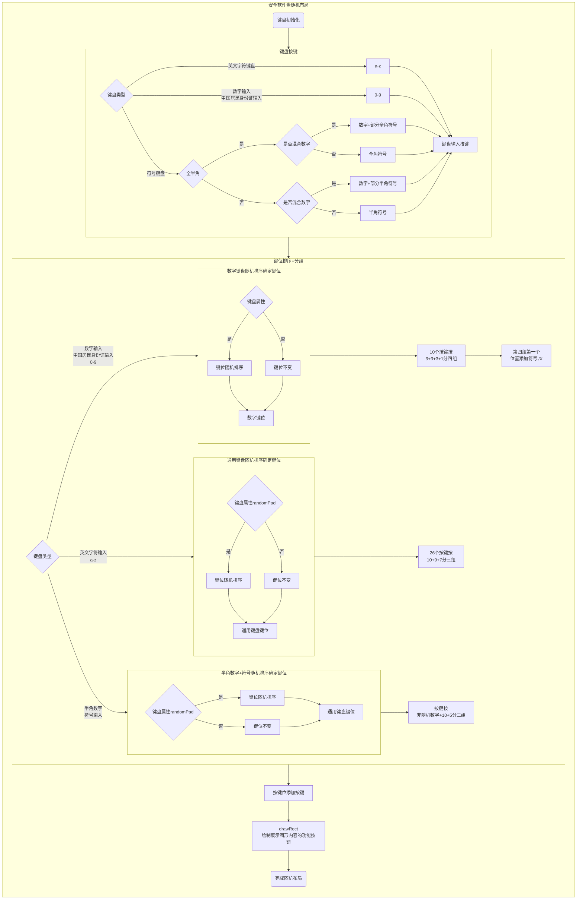
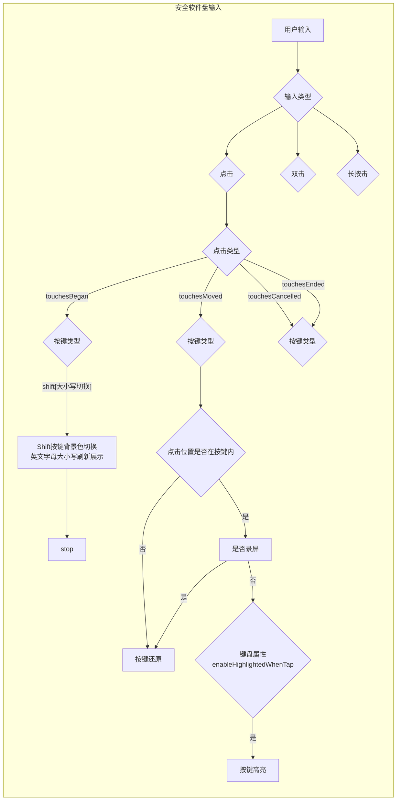
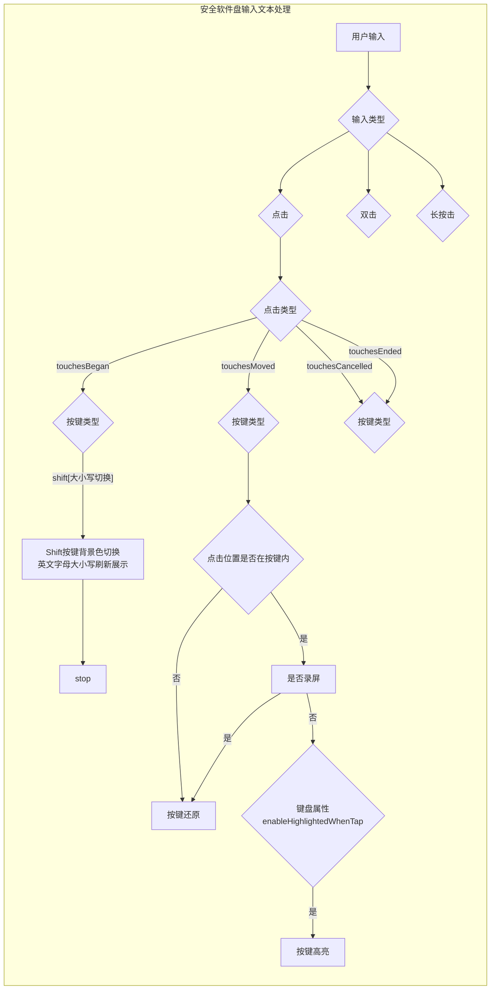

<!--
 * @Author: 梅继高
 * @Date: 2021-12-07 21:07:27
 * @LastEditTime: 2025-06-17 16:40:57
 * @LastEditors: Dengni8023
 * @Description: 
 * @FilePath: /JGSourceBase/JGSourceBase/JGSSecurityKeyboard/README.md
 * Copyright © 2021 MeiJigao. All rights reserved.
-->
# `JGSourceBase`自定义安全键盘

`JGSSecurityKeyboard`使用手册及方案介绍

[TOC]

## `JGSourceBase`自定义安全键盘设计

`iOS`自定义安全键盘需要修改输入框的`inputView`属性为`JGSSecurityKeyboard`实例，该属性一般在文本框初始化时指定。














1. `JGSSecurityKeyboard`内布局设计包含：
	- 顶部工具：`JGSKeyboardToolbar`
	
	- 键盘输入区域：
	
		- 字母、符号输入按键：英文字母、数字、全（中文）半（英文）角符号
	
		- 功能按键：键盘切换、符号切换、全半角切换、大小写切换、空格、删除、回车换行
		
		```
		按照键盘输入内容分别涉及的键盘输入区域：
		英文字母输入：JGSLetterKeyboard
		数字、中国居民身份证号输入：JGSNumberKeyboard
		全（中文）半（英文）角符号输入：JGSSymbolKeyboard
		```

	- 监听设备转屏切换，更新键盘布局（此时进更新按键展示大小，键位不变）

2. 键盘输入安全设计：

	- `JGSKeyboardKey`自定义按钮，继承自`UILabel`，接受用户的点击(`Touch`)、长按(`LongPressGesture`)、双击(`TapGesture`)操作，实现用户输入。

	- 键盘非功能键位随机布局，对要展示的按键标题进行随机排序后，布局键盘输入按键。
	
	- 为节省图片资源占用空间，使用图形绘制方式绘制展示为图形的功能按键。
	
	- 所有按键事件经由`[JGSBaseKeyboard keyboardKeyAction: event:]`传递到`[JGSSecurityKeyboard keyboardKeyAction: key: keyEvent:]`进行内容输入、功能切换处理，针对内容输入，经`[JGSSecurityKeyboard keyboardInputText:]`传递到系统组件扩展的自定义方法`[id<JGSSecurityKeyboardTextInput> jg_keyboardInputText:]`进行输入内容处理。
	
	- `[id<JGSSecurityKeyboardTextInput> jg_keyboardInputText:]`方法内部判断系统输入组件的`delegate`的各方法判断是否允许输入用户的输入，如需用户输入，则调用系统输入组件的`[id<JGSSecurityKeyboardTextInput> setText:]`方法进行后续处理。
	
	- 使用`Method Swizzing`方案，在用户输入时`hook`系统组件的`setText:`方法将用户输入内容存入自定义属性`jg_securityOriginText`、同时对系统组件填充无意义字符`•`；在用户获取文本内容时`hook`系统组件的`text`方法返回填充的无意义字符。

	```
	- (void)JGSSwizzing_setText:(NSString *)text {
    
		self.jg_securityOriginText = text;
		if ([self.inputView isKindOfClass:[JGSSecurityKeyboard class]] && self.isSecureTextEntry) {
			// 掩码显示 "•"
			NSString *dotSecStr = @"";
			for (NSInteger i = 0; i < text.length; i++) {
				dotSecStr = [dotSecStr stringByAppendingString:JGSSecurityKeyboardSecChar];
			}
			text = dotSecStr;
		}
		[self JGSSwizzing_setText:text];
	}

	- (NSString *)JGSSwizzing_text {
		
		// textField.text 不能直接返回输入原始值，原始值通过 textField.jg_securityOriginText 获取，避免调试hook系统接口抓取输入原始值
		//if ([self.inputView isKindOfClass:[JGSSecurityKeyboard class]]) {
		//    return self.jg_securityOriginText;
		//}
		return [self JGSSwizzing_text];
	}
	```
	
	- 系统输入组件自定义属性`jg_securityOriginText`，在`set`方法中进行输入内容的加密、内存记录存储；在`get`方法中对内存记录内容解密解密、返回给外部。

	```
	- (void)setJg_securityOriginText:(NSString *)jg_securityOriginText {
		
		if (![self.inputView isKindOfClass:[JGSSecurityKeyboard class]]) {
			return;
		}
		
		JGSSecurityKeyboard *securityKeyboard = (JGSSecurityKeyboard *)self.inputView;
		if (!securityKeyboard.aesEncryptInputCharByChar) {
			NSString *secText = [securityKeyboard aesOperation:kCCEncrypt text:jg_securityOriginText];
			objc_setAssociatedObject(self, &kJGSSecurityKeyboardTextInputOriginTextKey, secText, OBJC_ASSOCIATION_COPY_NONATOMIC);
			return;
		}
		
		NSMutableArray<NSString *> *secText = @[].mutableCopy;
		for (NSInteger i = 0; i < jg_securityOriginText.length; i++) {
			NSString *charText = [jg_securityOriginText substringWithRange:NSMakeRange(i, 1)];
			[secText addObject:[securityKeyboard aesOperation:kCCEncrypt text:charText]];
		}
		objc_setAssociatedObject(self, &kJGSSecurityKeyboardTextInputOriginTextKey, secText.copy, OBJC_ASSOCIATION_COPY_NONATOMIC);
	}

	- (NSString *)jg_securityOriginText {
		
		if (![self.inputView isKindOfClass:[JGSSecurityKeyboard class]]) {
			return self.text;
		}
		
		JGSSecurityKeyboard *securityKeyboard = (JGSSecurityKeyboard *)self.inputView;
		if (!securityKeyboard.aesEncryptInputCharByChar) {
			
			NSString *secText = objc_getAssociatedObject(self, &kJGSSecurityKeyboardTextInputOriginTextKey);
			return [securityKeyboard aesOperation:kCCDecrypt text:secText];
		}
		
		NSArray<NSString *> *secText = objc_getAssociatedObject(self, &kJGSSecurityKeyboardTextInputOriginTextKey);
		NSMutableString *jg_securityOriginText = @"".mutableCopy;
		for (NSString *obj in secText) {
			[jg_securityOriginText appendString:[securityKeyboard aesOperation:kCCDecrypt text:obj]];
		}
		
		return jg_securityOriginText.copy;
	}
	```

## 键盘布局设计思路

1. 根据设备（`iPhone`/`iPad`）屏幕的宽、键盘输入按钮的宽高比、按键水平以及垂直方向的间隔，分别计算出设备横竖屏状态的键盘高度。
2. 根据设备的`safeArea`、设备宽、键盘高，计算并缓存键盘输入区域的大小。
3. 键盘输入区域根据键盘显示区域大小、按键行、列展示情况计算每个按钮的布局。
4. 每个按钮`JGSKeyboardKey`继承`UILabel`实现点击、长按、双击操作处理。
5. 应用旋转时更新键盘高度，对应键盘输入区域变化，按键重新布局。
6. 键盘整体为自动布局，处理`SafeArea`边距等问题；键盘输入区域使用非自动布局，仅需要处理输入区域内部的布局计算处理。

### 键盘转屏高度修改

应用转屏时键盘布局适配关键在于键盘高度修改，键盘宽度系统自动根据屏幕宽度重新布局（键盘内部元素布局需开发处理）

1. 自定义键盘初始化时必须指定大于0的高度，否则后续键盘不会展示，更新高度也不会生效。
2. 键盘转屏需要监听系统通知进行键盘高度更新，可监听的通知包括：
	
		1、UIApplicationDidChangeStatusBarOrientationNotification
		2、UIKeyboardWillChangeFrameNotification
		3、UIKeyboardDidChangeFrameNotification
		4、UIKeyboardWillShowNotification

应用方向变化等导致键盘大小变化处理，需要考虑通知接收频率、及性能问题：

> 仅监听 UIKeyboardWillChangeFrameNotification 即可实现修改键盘高度操作
> 
> 通知执行顺序大概（键盘高度不实际更新是存在差异情况）如下：
> 
>  1、UIApplicationDidChangeStatusBarOrientationNotification：应用转屏后执行一次，最先执行
> 
> 2、UIKeyboardWillChangeFrameNotification：键盘弹出、应用转屏均会执行，如果收到通知不进行键盘高度更新，则仅执行一次，每更新一次则会重复执行一次
> 
> 3、UIKeyboardDidChangeFrameNotification：与keyboardWillChangeFrame配对执行，如果收到通知不进行键盘高度更新，则仅执行一次，每更新一次则会重复执行两次
> 
> 4、UIKeyboardWillShowNotification：键盘弹出、应用转屏均会执行，如果收到通知不进行键盘高度更新，则仅执行一次，每更新一次则会重复执行一次
	    
经测试：

> 1、在键盘高度不实际更新（调用更新方法，但是键盘实际高度不变）的情况下 UIKeyboardWillShowNotification 执行顺序在 UIKeyboardDidChangeFrameNotification 之后
> 
> 2、其他情况 UIKeyboardWillShowNotification、UIKeyboardDidChangeFrameNotification 执行顺序和高度更新的时机存在关联，可自行测试

收到 `UIKeyboardWillChangeFrameNotification`、 `UIKeyboardWillShowNotification`、 `UIKeyboardDidChangeFrameNotification` 时：
 
> 1、需要判断当前输入框是否有焦点，多个输入框同时存在时，系统通知可能多次发送
> 
> 2、每个通知处理方法均可执行键盘高度更新，UIKeyboardDidChangeFrameNotification 更新则会重复更新键盘高度，不建议在此处更新
> 
> 3、UIKeyboardWillShowNotification 通知中更新高度，则需要待转屏动画执行结束后键盘高度更新才会执行
> 
> <font color="red">综上，键盘高度更新在 UIKeyboardWillChangeFrameNotification 中进行最合适</font>
	    

`UIKeyboardWillShowNotification`中更新高度注意：

<font color="red">

转屏时`UIKeyboardWillChangeFrameNotification`通知首次执行在`UIKeyboardDidChangeFrameNotification`通知之后

如仅在`UIKeyboardWillShowNotification`更新键盘高度，键盘转屏动画完成之后才会执行键盘高度更新操作，键盘高度变化不流畅

</font>

### 键盘输入区域键盘、按键布局刷新

由于键盘整体自动布局，键盘高度变化后，键盘输入区域`frame`会发生变化，根据键盘输入区域的整体大小、普通按钮的宽高比、功能按钮（键盘切换、符号切换、全半角切换、大小写切换、空格、删除、回车换行）宽度与普通按钮按照一定比例处理，计算各按钮的`frame`。

1. 初始化时大概计算一次个按钮的布局。
2. 在键盘展示时、转屏等情况，在键盘的layoutSubviews方法中重新计算、更新键盘布局。

## `JGSourceBase`自定义安全键盘类说明

1. JGSBaseKeyboard：键盘输入区域键盘的父类
2. JGSKeyboardConstants：键盘布局、样式定义常、变量
3. JGSKeyboardToolbar：键盘顶部工具条，在键盘有标题时显示
4. JGSLetterKeyboard：英文字母输入键盘
5. JGSNumberKeyboard：数字输入键盘，支持身份证号输入键盘
6. JGSSecurityKeyboard：安全键盘入口文件
7. JGSSymbolKeyboard：符号输入键盘

## 键盘效果图（iPhone XS）

<table>
<tr>
<td></td>
<td></td>
<td></td>
</tr>
</table>


# 参考资料

1. [SecurityKeyboard设计思路解读](http://dengni8023.top/2021/12/04/iOS自定义安全键盘JGSourceBase解读)